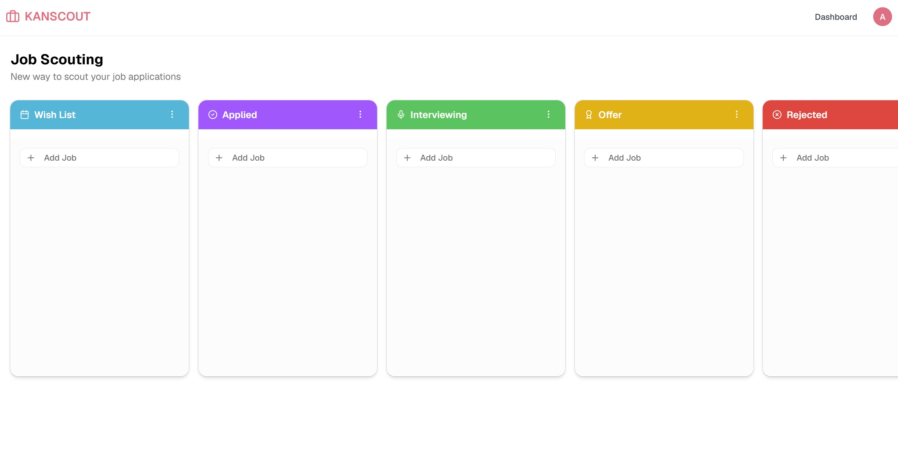
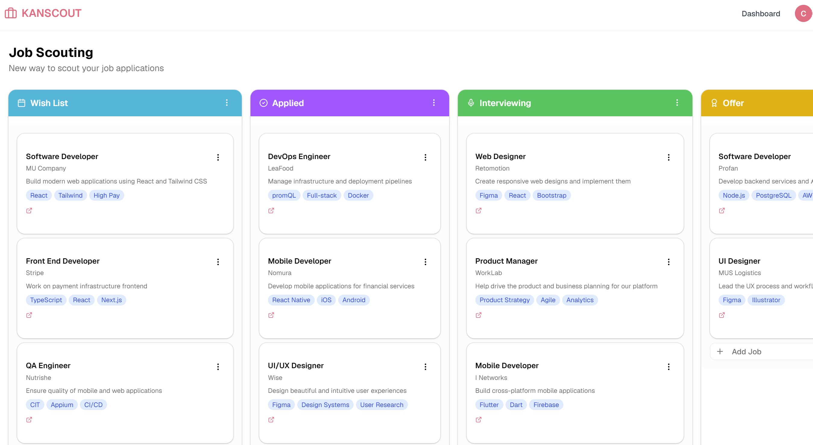
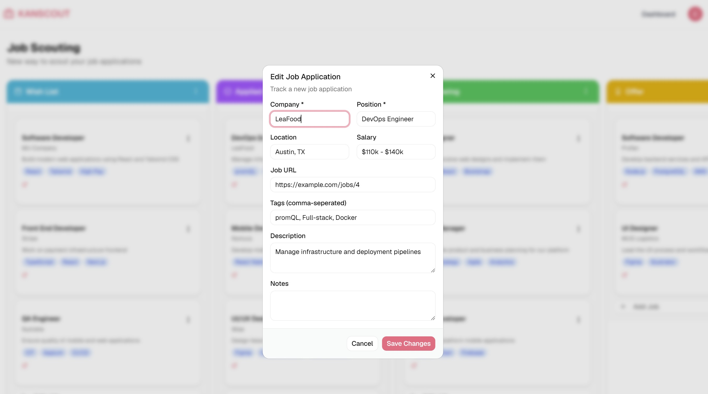

# Kanscout

**Scout jobs and track applications with Kanscout** — An intuitive visual Kanban board designed for looking for jobs, organizing your job search, and tracking every application from discovery to offer.

---

## 📸 App Preview

| Organize Applications | Get Hired | Manage Boards |
| :---: | :---: | :---: |
|  |  |  |

---

## ✨ Features

- 🔍 **Scout Opportunities**: Organize your job search seamlessly. Store target roles and customize Kanban columns for every stage of looking for a job.
- 📋 **Kanban Application Tracker**: Track job application progress from Wish List to Interviewing to Offer with intuitive drag-and-drop visual Kanban boards.
- 📊 **All-in-One Dashboard**: Never lose track of a job application. View metrics including Total Applications, Active Interviews, Final Offers, and Rejection Rates at a glance.
- 📝 **Application Management**: Keep all notes, interview schedules, salary details, and application statuses organized in one central place.

---

## 🛠️ Tech Stack

- **Framework**: [Next.js 16](https://nextjs.org/) (App Router) & [React 19](https://react.dev/)
- **Styling**: Tailwind CSS v4, Lucide Icons, Shadcn UI / Base UI
- **Drag and Drop**: `@dnd-kit/core` & `@dnd-kit/sortable`
- **Database & ODM**: MongoDB & Mongoose
- **Authentication**: Better Auth

---

## 🚀 Getting Started

### Prerequisites

- Node.js 18+
- MongoDB instance (local or MongoDB Atlas)

### Installation

1. Clone the repository:
   ```bash
   git clone https://github.com/your-username/kanscout.git
   cd kanscout
   ```

2. Install dependencies:
   ```bash
   npm install
   ```

3. Configure Environment Variables (`.env.local`):
   ```env
   MONGODB_URI=your_mongodb_connection_string
   BETTER_AUTH_SECRET=your_auth_secret
   BETTER_AUTH_URL=http://localhost:3000
   ```

4. (Optional) Seed sample data:
   ```bash
   npm run seed:jobs
   ```

5. Run the development server:
   ```bash
   npm run dev
   ```

6. Open [http://localhost:3000](http://localhost:3000) in your browser.
